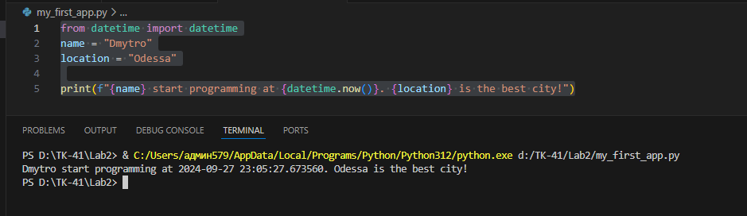
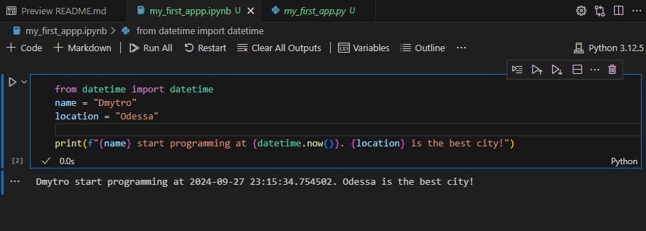
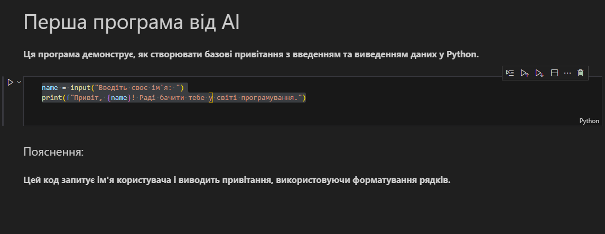
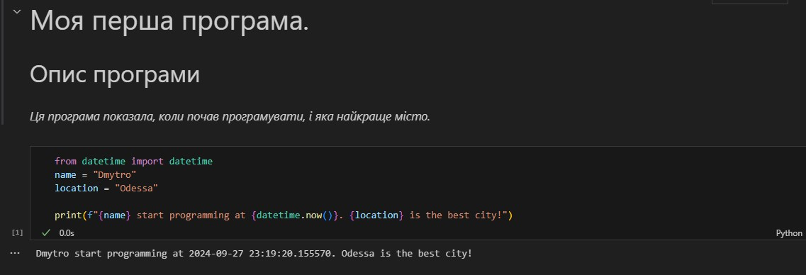

# Звіт до роботи
## Тема: _Оформлення робіт та перша програма_
### Мета роботи: _Оформити роботу та зробити першу програму_

---
### Виконання роботи
* Результати виконання завдання *Лабораторна роботаN1*;
  
1. 
1. 
1. 
1. 

* вставлений код / текстовий або числовий результат / інші результати:
    - так можн вставляти код, або просто вствляйте посилання на файл з програмою;
    ```python
    from datetime import datetime
    name = "Dmytro"
    location = "Odessa"
    ```
    ```python
    name = input("Введіть своє ім'я: ")
    print(f"Привіт, {name}! Раді бачити тебе у світі програмування.")
    ```

* результати виконання індивідуального завдання (якщо такі є);

---
### Висновок:
> у висновку потрібно відповісти на запитання:

- :question: Що зроблено в роботі;
__Створено структуру Notebook, додано програму від AI з поясненням та оформлено комірки Markdown.__
- :question: Чи досягнуто мети роботи;
__Так__
- :question: Які нові знання отримано;
__Робота з Markdown, оформлення звітів у Notebook, інтеграція коду з поясненнями.__
- :question: Чи вдалось відповісти на всі питання задані в ході роботи;
__Думаю що так__
- :question: Чи вдалося виконати всі завдання;
__Так__
- :question: Чи виникли складності у виконанні завдання;
__Ні__
- :question: Чи подобається такий формат здачі роботи (Feedback);
__Так__
- :question: Побажання для покращення (Suggestions);
__Нема__

---
